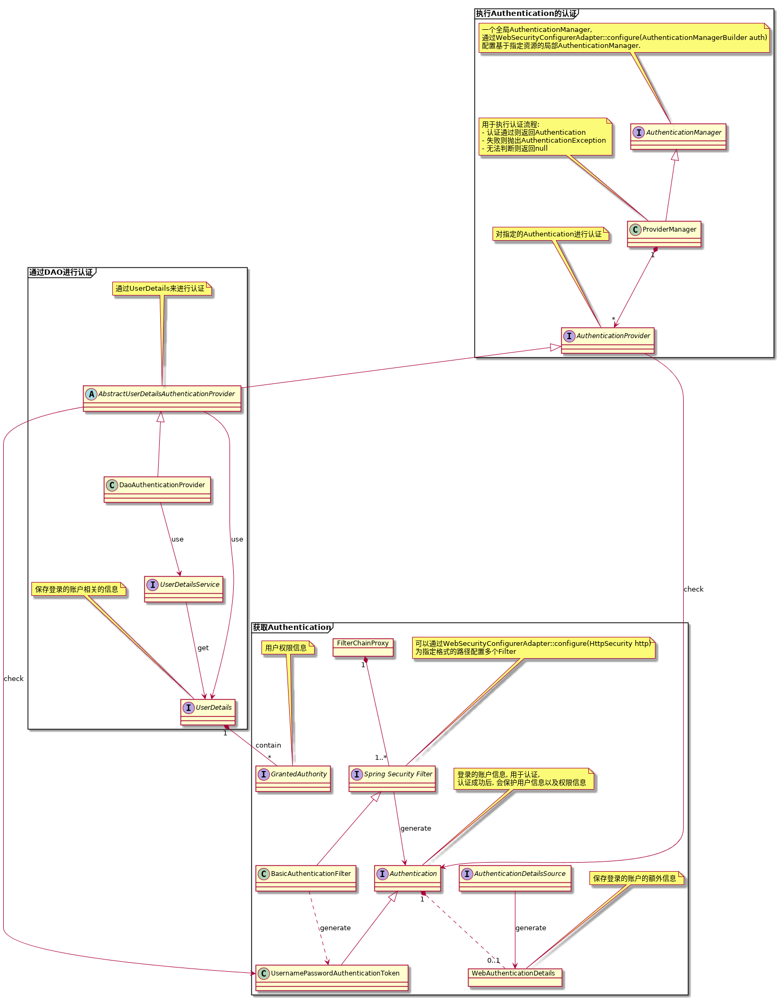

# Spring Security --- 认证框架的设计

认证是对**登录用的账户**的合法性进行验证, 
然后获取到应用相关的**短期凭证**, 
之后使用短期凭证去获取**用户**的相关资源的过程.

凭证的种类一般包括:

- 账户(account)
- 短期凭证(token)

认证核心元素:

- FilterChainProxy, Spring Security的入口, 是Servlet中处理请求的Filter处理链中的一个Filter
- SecurityFilterChain, 通过相关的Filter处理链, 对**指定路由**的安全进行处理
- Authentication, 描述凭证信息, 在验证通过后, 保存用户信息, **通过特定的Filter获取特定的Authentication**
  - WebAuthenticationDetails, 保持凭证相关的额外信息
- AuthenticationManager, 管理整个验证流程
  - ProviderManager, 管理多个相关的AuthenticationProvider
- AuthenticationProvider, 对指定的Authentication进行验证
  - 认证通过, 返回认证成功的Authentication
  - 认证失败, 抛出AuthenticationException
  - 无法判断, 返回null, 交由上层模块继续处理
- SecurityContextHolder, 用于访问SecurityContext
  - SecurityContext, 保存了通过认证的当前登录用户的凭证信息

## 对认证进行配置

- HttpSecurity
  - 指定SecurityFilterChain的相关路由
  - 相关路由的鉴权配置
  - 对SecurityFilterChain配置相关的SecurityFilter
- AuthenticationManagerBuilder
  - 配置相关的AuthenticationProvider

## Remember-Me Authentication

用户登录过一次之后, 可以在一段时间内不需要重复登录.

一般会借助保存在cookie中的session来实现自动登录.

Spring提供了两种实现, 但都必须要提供**UserDetailsService**的实现:

- Hash-Based Token, 加密后的token被保存在cookie中, 
token包含所有的用户登录信息, 包括用户名和密码
- Persistent Token, 生成随机token, 并相关的用户登录信息到存储中

## Pre-Authentication Framework Classes

[TODO](https://docs.spring.io/spring-security/site/docs/5.2.0.RELEASE/reference/htmlsingle/#pre-authentication-framework-classes)

## Reference

- [demo]()
